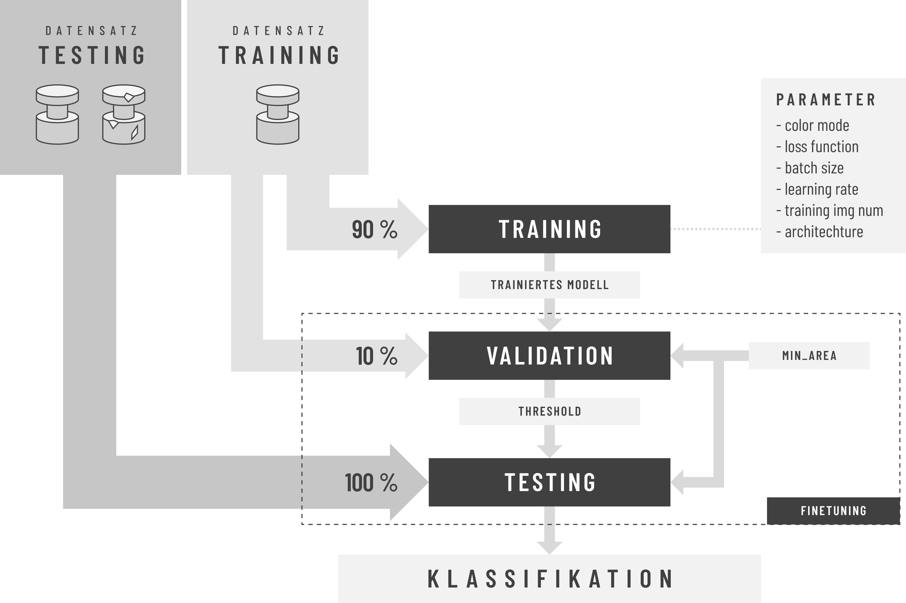

# Anomaly Detection
This project proposes an end-to-end framework for semi-supervised Anomaly Detection and Segmentation in images based on Deep Learning.

## Method Overview
The proposed method employs a thresholded pixel-wise difference between reconstructed image and input image to localize anomaly. The threshold is determined by first using a subset of anomalous-free training images, i.e validation images, to determine possible values of minimum area and threshold pairs followed by using a subset of both anomalous-free and anomalous test images to select the best pair for classification and segmentation of the remaining test images.

It is inspired to a great extent by the papers [MVTec AD — A Comprehensive Real-World Dataset for Unsupervised Anomaly Detection](https://www.mvtec.com/fileadmin/Redaktion/mvtec.com/company/research/mvtec_ad.pdf) and [Improving Unsupervised Defect Segmentation by Applying Structural Similarity to Autoencoders](https://arxiv.org/abs/1807.02011).
The method is devided in 3 steps: training, finetuning and testing.



**NOTE: Why Semi-Supervised and not Unsupervised?**

The method proposed in the [MVTec paper](https://www.mvtec.com/fileadmin/Redaktion/mvtec.com/company/research/mvtec_ad.pdf) is unsupervised, as a subset containing only anomaly-free training images (validation set) are used during the validation step to determine the threshold for classification and segmentation of test images. However, the validation algorithm is based on a user input parameter, the minimum defect area, which definition remains unclear and unexplained in the aforementioned paper. Because the choice of this parameter can greatly influence the classification and segmentation results and in an effort to automate the process and remove the need for all user input, we developed a finetuning algorithm that computes different thresholds corresponding to a wide range of discrete minimum defect areas using the validation set. Subsequently, a small subset of anomaly and anomaly-free images of the test set (finetuning set) is used to select the best minimum defect area and threshold pait that will finally be used to classify and segment the remaining test images. Since our method relies on test images for finetuning, we describe it as being semi-supervised.

## Dataset

The proposed framework has been tested successfully on the [MVTec dataset](https://www.mvtec.com/company/research/datasets/mvtec-ad/).

## Models

There is a total of 5 models based on the Convolutional Auto-Encoder (CAE) architecture implemented in this project:
* *mvtecCAE* is the model implemented in the [MVTec Paper](https://www.mvtec.com/fileadmin/Redaktion/mvtec.com/company/research/mvtec_ad.pdf)
* *baselineCAE* is inspired by: https://github.com/natasasdj/anomalyDetection
* *inceptionCAE* is inspired by: https://github.com/natasasdj/anomalyDetection
* *resnetCAE* is inspired by: https://arxiv.org/pdf/1606.08921.pdf
* *skipCAE* is inspired by: https://arxiv.org/pdf/1606.08921.pdf

**NOTE:**

*mvtecCAE*, *baselineCAE* and *inceptionCAE* are comparable in performance.

**WARNING:**

*resnetCAE* and *skipCAE*, are still being tested, as they are prone to overfitting, which translates in the case of convolutional auto-encoders by copying its inputs without filtering out the defective regions.

## Prerequisites

### Dependencies
The main libraries used in this project with their corresponding versions are listed below: 
* `tensorflow == 2.1.0`
* `ktrain == 0.21.3`
* `scikit-image == 0.16.2`
* `scikit-learn == 0.23.2`

For more information, refer to `requirement.txt`.

### Installation
Before installing dependencies, we highly recommend setting up a virtual anvironment (e.g., anaconda environment).

1. Make sure pip is up-to-date with: `pip install -U pip`
2. Install [TensorFlow 2](https://www.tensorflow.org/install) if it is not already installed (e.g., `pip install tensorflow==2.1`).
3. Install [ktrain](https://github.com/amaiya/ktrain): `pip install ktrain`
4. Install [scikit-image](https://scikit-image.org/): `pip install scikit-image`
5. Install [scikit-learn](https://scikit-learn.org/stable/): `pip install scikit-learn`

The above should be all you need on Linux systems and cloud computing environments like Google Colab and AWS EC2. If you are using ktrain on a Windows computer, you can follow the more detailed instructions provided [here](https://github.com/amaiya/ktrain/blob/master/FAQ.md#how-do-i-install-ktrain-on-a-windows-machine) that include some extra steps.


### Download the Dataset
1. Download the mvtec dataset [here](https://www.mvtec.com/company/research/datasets/mvtec-ad/) and save it to a directory of your choice (e.g in /Downloads)
2. Extract the compressed image files.
3. Create a folder in the project directory to store the image files.
4. Move the extracted image files to that folder.


Directory Structure using mvtec dataset
------------
For the scripts to work propoerly, it is required for the folder containing the training and test images to have a specific structure. 
In the case of using the *mvtec* dataset, here is an example of how the directory stucture should look like:

    ├── bottle
    │   ├── ground_truth
    │   │   ├── broken_large
    │   │   ├── broken_small
    │   │   └── contamination
    │   ├── test
    │   │   ├── broken_large
    │   │   ├── broken_small
    │   │   ├── contamination
    │   │   └── good
    │   └── train
    │       └── good
    ...


--------

Directory Structure using your own dataset
------------
To train with your own dataset, you need to have a comparable directory structure. For example:

    ├── class1
    │   ├── test
    │   │   ├── good
    │   │   ├── defect
    │   └── train
    │       └── good
    ├── class2
    │   ├── test
    │   │   ├── good
    │   │   ├── defect
    │   └── train
    │       └── good
    ...


--------

## Usage

### Training (`train.py`)

During training, the CAE trains exclusively on defect-free images and learns to reconstruct (predict) defect-free training samples.

usage: train.py [-h] -d  [-a] [-c] [-l] [-b] [-i]

optional arguments:

  -h, --help            show this help message and exit

  -d , --input-dir      directory containing training images

  -a , --architecture   architecture of the model to use for training: 'mvtecCAE', 'baselineCAE', 'inceptionCAE' or 'resnetCAE'

  -c , --color          color mode for preprocessing images before training: 'rgb' or 'grayscale'

  -l , --loss           loss function to use for training: 'mssim', 'ssim' or 'l2'

  -b , --batch          batch size to use for training

  -i, --inspect         generate inspection plots after training


Example usage:
```
python3 train.py -d mvtec/capsule -a mvtecCAE -b 8 -l ssim -c grayscale
```
**NOTE:** 

There is no need for the user to pass a number of epochs since the training process implements an Early Stopping strategy.


### Finetuning (`finetune.py`)
This script used a subset of defect-free training images and a subset of both defect and defect-free test images to determine good values for *minimum defect area* and *threshold* pair of parameters that will be used during testing for classification and segmentation.

usage: finetune.py [-h] -p  [-m] [-t]

optional arguments:
  -h, --help      show this help message and exit

  -p , --path     path to saved model

  -m , --method   method for generating resmaps: 'ssim' or 'l2'

  -t , --dtype    datatype for processing resmaps: 'float64' or 'uint8'


Example usage:
```
python3 finetune.py -p saved_models/mvtec/capsule/mvtecCAE/ssim/13-06-2020_15-35-10/mvtecCAE_b8_e39.hdf5 -m ssim -t float64
```

### Testing (`test.py`)

This script classifies test images using the *minimum defect area* and *threshold* previously approximated at the finetuning step.

usage: test.py [-h] -p  [-s]

optional arguments:
  -h, --help    show this help message and exit

  -p , --path   path to saved model
  
  -s, --save    save segmented images


Example usage:
```
python3 test.py -p saved_models/mvtec/capsule/mvtecCAE/ssim/13-06-2020_15-35-10/mvtecCAE_b8_e39.hdf5
```


Project Organization
------------

    ├── mvtec                       <- folder containing all mvtec classes.
    │   ├── bottle                  <- subfolder of a class (contains additional subfolders /train and /test).
    |   |── ...
    ├── autoencoder                 <- directory containing modules for training: autoencoder class and methods as well as custom losses and metrics.
    ├── processing                  <- directory containing modules for preprocessing images and before training and processing images after training.
    ├── results                     <- directory containing finetuning and test results.
    ├── readme.md                   <- readme file.
    ├── requirements.txt            <- requirement text file containing used libraries.
    ├── saved_models                <- directory containing saved models, training history, loss and learning plots and inspection images.
    ├── train.py                    <- training script to train the auto-encoder.
    ├── finetune.py                 <- approximates a good value for minimum area and threshold for classification.
    └── test.py                     <- test script to classify images of the test set using finetuned parameters.


--------

## Authors

* **Adnene Boumessouer** - https://github.com/AdneneBoumessouer

## License

This project is licensed under the MIT License - see the [LICENSE.md](LICENSE.md) file for details

## Acknowledgments

* Paul Bergmann, Michael Fauser, David Sattlegger and Carsten Steger, the authors of the [MVTec paper](https://www.mvtec.com/fileadmin/Redaktion/mvtec.com/company/research/mvtec_ad.pdf) which this project has been inspired by.
* François Chollet, author of [Keras](https://keras.io/).
* Aurélien Géron, autor of the great book [Hands-On Machine Learning with Scikit-Learn, Keras, and TensorFlow, 2nd Edition](https://www.oreilly.com/library/view/hands-on-machine-learning/9781492032632/).
* Arun S. Maiya, author of the [ktrain](https://github.com/amaiya/ktrain) deep learning library.
* Adrian Rosebrock, founder of the website [pyimagesearch](https://www.pyimagesearch.com/) for computer vision.